# Employee Management System

A simple desktop application built in **Java (Swing)** with **MySQL** database to manage employees in an organization.

---

## 📌 Features

- Add new employees
- Update employee information
-Search employee by employee id
- View employee list
-Login as a Admin
-Login as a Employee
-Extract employee infrmation
- Department & Designation dropdowns (linked with database)

---

## 💻 Technologies Used

- Java (Swing for GUI)
- MySQL (Database)
- JDBC (for DB connectivity)

---

## 📸 Screenshots

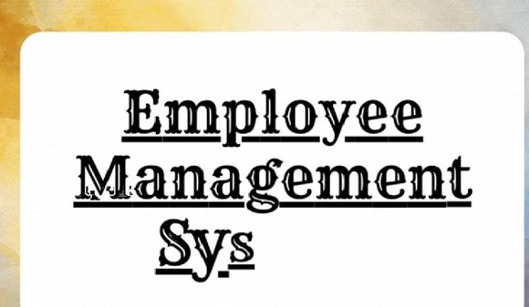
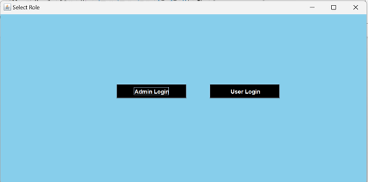
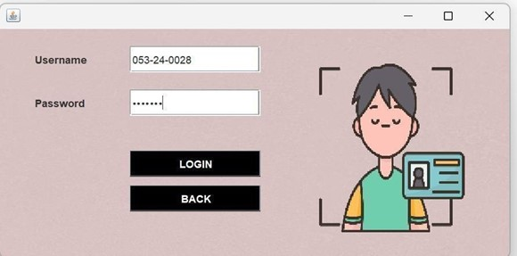
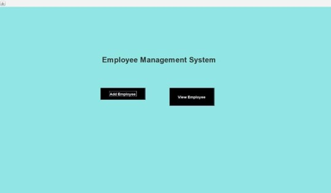
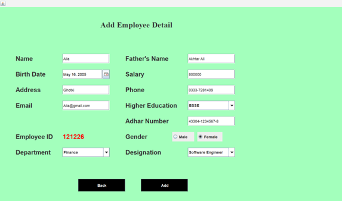
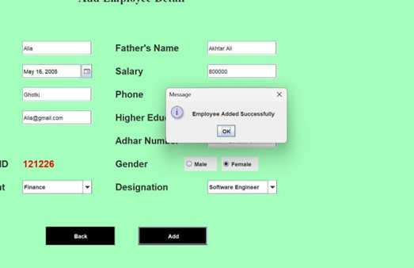
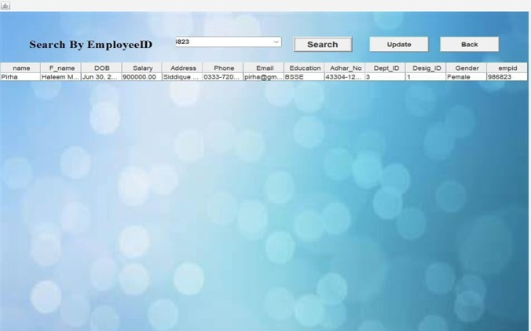
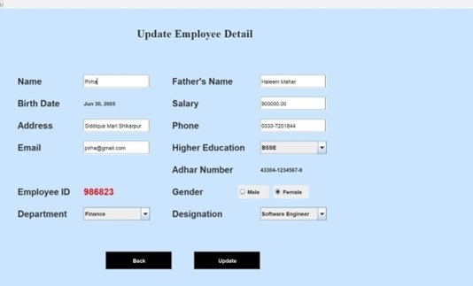
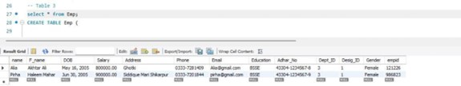
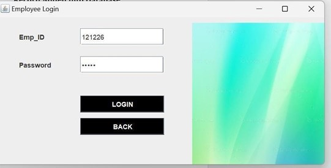
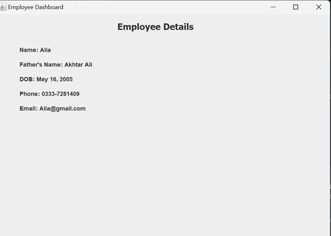

---

## 👩‍🎓 Author

**Pirha Mahar**  
Computer Science Student, IBA Sukkur  
(1 Year Completed)

---

## 📌 Note

This is a university-level academic project. Contributions or feedback are welcome!
